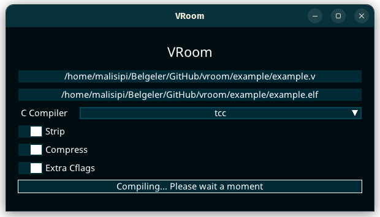

# VRoom

A program to build the smallest Vlang executable possible.
Please note that this may break executables or make cryptic errors.
Also, this is a short PoC about executable optimization for V and it was
not recommend for production use.

## Requirements

This program requires the following:
* Vlang compiler
* C Compiler (one of Tcc, Gcc or Clang)
* Strip utility (Optional)
* UPX utility (Optional)

## Usage

Use GUI



or command line

```
$ vroom [path/to/file.v or path/to/dir] -o [output_executable]
```

## Example

```
$ vroom ./example.v -o example.elf
```

## Size benchmarks

Using V 0.3.3 791ef4b as a baseline on x86_64.

| Tool/Compiler        | Command                                                      | Binary size |
|----------------------|--------------------------------------------------------------|-------------|
| VRoom (clang/gc)     | vroom example -o vroom.elf                                   |  29,8 kB    |
| V     tcc            | v example -prod -gc none -o tcc.elf                          | 233,3 kB    |
| clang 15.0.7         | v example -prod -gc none -o s.c && clang -Oz s.c -o clang.elf| 167,6 kB    |
| gcc   12.2.1 20230111| v example -prod -gc none -o s.c && gcc -Os s.c -o gcc.elf    | 175,5 kB    |

## Compiling

```
$ v install malisipi.mui
$ v .
```